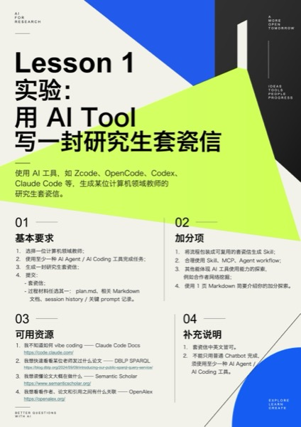
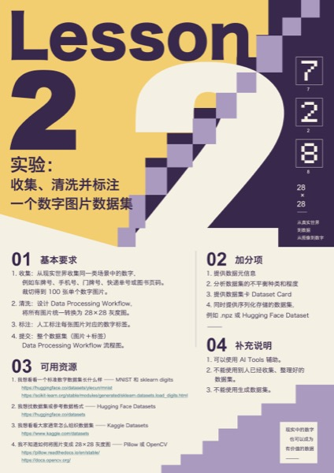

# Course-2026Fall

华东师范大学数据科学与工程学院《统计方法与机器学习》2026 年秋季课程仓库。

## 📋 分组报名（进行中）

👉 **[点此报名分组](https://github.com/DaSE-ML/Course-2026Fall/issues/new?template=group-signup.yml)**：每组 **4–5 人**，只需粘贴全组成员的 GitHub 用户名（每行一个 `@用户名`），提交后机器人**自动分配组号**（ML26-01 起）并回帖确认。⚠️ 请勿在报名中填写真实姓名、学号等个人信息。名单变动时编辑报名 issue 即可自动更新。

各组后续在对应的私有仓库 `ML26-01` ~ `ML26-25` 中提交作业与项目（仅本组成员与教师可见）。

## 🧪 实验课任务

<table>
  <thead>
    <tr>
      <th width="130">任务</th>
      <th width="340">任务海报（点击看全图）</th>
      <th width="330">提交目录与交付物</th>
    </tr>
  </thead>
  <tbody>
    <tr>
      <td valign="top"><strong>Lesson 1</strong>  用 AI Tool 写一封研究生 套瓷信</td>
      <td align="center" valign="top"></td>
      <td valign="top">
        
<strong>提交到哪里？</strong> 各组私有仓库 <code>ML26-XX</code> 根目录下的 <code>lab01/</code> 文件夹。

        
<strong>提交什么？</strong> ① 套瓷信（中英文皆可） ② 一份过程材料，以下任选其一：

        <ul>
          <li><code>plan.md</code></li>
          <li>相关 Markdown 文档</li>
          <li>session history / 关键 prompt 记录</li>
        </ul>
      </td>
    </tr>
    <tr>
      <td valign="top"><strong>Lesson 2</strong>  收集、清洗 并标注一个 数字图片数据集</td>
      <td align="center" valign="top"></td>
      <td valign="top">
        
<strong>提交到哪里？</strong> 各组私有仓库 <code>ML26-XX</code> 根目录下的 <code>lab02/</code> 文件夹。

        
<strong>提交什么？</strong> ① 整个数据集（图片与标签） ② Data Processing Workflow 流程图

        
<strong>数据要求</strong> 从现实世界收集，不可使用现成或生成的数据集。可以使用 AI Tools 辅助。

      </td>
    </tr>
  </tbody>
</table>

**统一提交方式：** 作业按组计，全组共用一份提交。将成果放入表中对应目录后直接 push 即可。组内自行协调分工与文件命名；看不到本组仓库请联系助教。详细要求与加分项见任务海报。

## 机器学习课程材料

机器学习部分面向本科三年级学生，共 10 讲、20 课堂学时，内容包括回归、分类、模型评估、模型选择、树与集成、支持向量机、无监督学习、文本表示与预训练模型。

学生材料位于 **[ml-2026/](ml-2026/)**，包括课件、实验 notebook、实验阅读版和作业说明。目前开放第1、2讲，其余内容将随课程进度发布。

进入 **[课程入口](ml-2026/index.html)** 可查看已经开放的章节。课件和实验阅读版可直接在浏览器中打开；需要运行 notebook 时，请按照 [环境与运行说明](ml-2026/README.md) 启动 JupyterLab。

## 课程讨论

欢迎同学们参与 [Discussions](https://github.com/DaSE-ML/Course-2026Fall/discussions)，交流课程内容、实验结果、学习体会和相关资料。发帖前请先搜索是否已有相近主题，并避免公开密码、Token、学号、电话等敏感信息。
